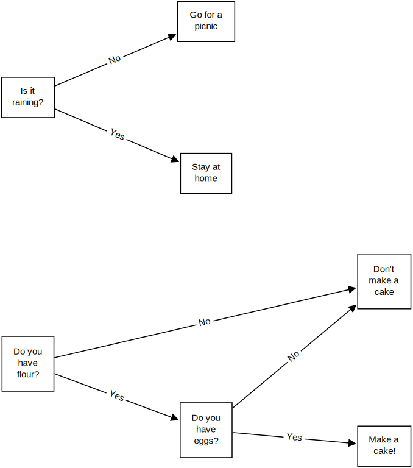

# Conditionals

Sometimes, in real life, we might want to act only when certain conditions are
met. For example, you might decide that you're only going for a picnic if it's
not raining or that you'll only try to make a cake if you have all the
ingredients.



<!-- OMITTED -->  

In programming, as in life, we need the ability to make decisions based on data.

<!-- OMITTED -->

## Learning Objectives

In this section, you'll learn to:

* Control what code executes using _if statements_.

## Part One: `if` and `else`

A common way to implement _conditional logic_ in Python is to use an `if`
statement. Take a look at the following example.

```python
>>> name = "Pedro Luis Gonçalo da Costa"
>>> if len(name) > 25:
...     print("That is a very long name")
...     print("Thanks!")
...
That is a very long name
Thanks!
```

In this code, Python will execute the code `len(name) > 25` which represents a
condition. Let's execute some parts of this to see what it does:

```python
>>> name = "Pedro Luis Gonçalo da Costa"
>>> len(name)
27
>>> len(name) > 25
True
```

Let's return to the original code and look at the `if`:

```python
>>> name = "Pedro Luis Gonçalo da Costa"
>>> if len(name) > 25:
...     print("That is a very long name")
...     print("Thanks!")
...
That is a very long name
Thanks!
```

Following the `if`, the condition, and the `:` are two lines of code that have
four spaces at the start. This is called _indentation_ and Python uses it to
define a chunk of code. This chunk of code will execute if and only if the
condition evaluates to `True` — in the case where the string `name` is more than
25 characters long.

<details>
  <summary>:speech_balloon: What about those `...` dots?</summary>

  <hr>
  
  You don't need to type those, they are just what the REPL will show you
  if you start an `if` block to indicate that it isn't complete yet.

  <hr>
</details>

<details>
  <summary>:speech_balloon: When I type that in it does nothing.</summary>

  <hr>
  
  Are you looking at something like this:

  ```python
  >>> name = "Pedro Luis Gonçalo da Costa"
  >>> if len(name) > 25:
  ...     print("That is a very long name")
  ...     print("Thanks!")
  ...
  ```

  If so, hit enter. Python needs you to do this so that it knows the `if` block
  is over, which you do by having a line without any indentation at the start.

  <hr>
</details>

<details>
  <summary>:speech_balloon: But what on earth is that <code>&gt;</code> symbol?</summary>

  <hr>
  
  The `>` symbol returns `True` if the value on the left is _greater than_ the
  value on the right. Otherwise it returns `False`.

  By contrast, the `<` symbol returns `True` if the value on the left is _less
  than_ the value on the right. Otherwise it returns `False`.

  I like to remember this by thinking of the symbol as a crocodile's jaws. The
  crocodile is hungry, and so always eats the biggest number.

  There are two further useful symbols `>=` and `<=`, which mean _greater than
  or equal to_ and _less than or equal to_ respectively.

  <hr>
</details>

At the moment this seems a bit pointless since the name is hard-coded. Let's try
it with another name:

```python
>>> name = "Eric Cantona"
>>> if len(name) > 25:
...     print("That is a very long name")
...     print("Thanks!")
...
```

Well, that prints nothing. The condition evaluates to `False` because `"Eric
Cantona"` is only twelve characters long.

If we wanted to print a message in the other case, we could do this:

```python
>>> name = "Eric Cantona"
>>> if len(name) > 25:
...     print("That is a very long name")
...     print("Thanks!")
...
>>> if len(name) <= 25:
...     print("That is not a very long name")
...
That is not a very long name
```

<details>
  <summary>:speech_balloon: I got a syntax error there.</summary>

  <hr>
  
  You'll need to make sure you leave a blank line after the `print("Thanks!")`
  line and before the `if len(name) <= 25` line. 
  
  This is so Python knows that the last `if` block has fully ended.

  <hr>
</details>

But that does seem like a lot of work. Instead, we can use `else`.

```python
>>> name = "Eric Cantona"
>>> if len(name) > 25:
...     print("That is a very long name")
...     print("Thanks!")
... else:
...     print("That is not a very long name")
...
That is not a very long name
```

When Python sees `else:` at the end of an `if` block, it knows to execute the
following block in the case that the condition evaluates to `False`. You can
think of it as "if XYZ then do this, _otherwise_ do that".

### Whitespace

As you have seen, after every `if ...` and `else` we end the line with a colon.
This signals to Python that a new block is going to begin. 

After this, we have to indent every line we want to be a part of that block with
four spaces.

```python
>>> if len("hello") > 2:
...     # this code executes
... else:
...     # this code does not execute
```

This is because Python is _whitespace dependant_. This means that indentation
matters. Python will interpret the gap left at the start of the line to mean
that the code on that line will execute only if the condition is `True`.

<details>
  <summary>:speech_balloon: Do all programming languages do this?</summary>

  <hr>
  
  No. In fact, Python is the only common language that does this. Other
  languages use symbols like braces (`{` and `}`) or keywords like `do` and
  `end`.

  Python made this choice because in all modern programming engineers use
  indentation to signify to the reader the structure of their code. Even where
  other keywords are used by the language, programmers will still use
  indentation because it is easier for humans to read it.

  But Guido van Rossum got tired of teaching novice programmers to use
  indentation. It took a lot of nagging, because his novices were only really
  worried about making things work and were still picking up what professional
  quality work meant in programming.

  So, he and his colleagues reasoned, if we make it an essential part of making
  programs work, we will no longer have to nag our students so much. We at
  Makers leave their decision to your judgement!

  <hr>
</details>

Just remember, as a rule of thumb, if a line of Python ends with a colon `:`
then the next line will be indented.

### Equal and Not Equal

To check whether two values are equal, we can use the `==` operator. This
compares the item on the left with the item on the right and returns `True` if 
they are equal.

``` python
>>> name = "Will"
>>> if name == "Will":
...     print("Hi Will!")
...
Hi Will!
```

We can also do the opposite with the `!=` operator:

``` python
>>> name = "June"
>>> if name != "Will":
...     print("Wait, who are you!")
...
Wait, who are you!
```

## Exercise

The following code is broken. Fix it up and get it running.

``` python
>>> name = "Ahmed"

if name == "Ahmed":
print("Hi, Ahmed")
else:
    print("Oh, a new friend!")
```

## Part Two: `elif`

In many situations there will be more than one thing that we wish to check,
which means we need some more _branches_ on our `if` statement. These can be
added using `elif`.

```python
>>> name = "Edward Jeremiah Smith"
>>> if len(name) > 25:
>>>     print("That is a very long name")
>>> elif len(name) > 20:
>>>     print("That is a long name")
>>> else:
>>>     print("That is not a particularly long name")
```

Now open up your Python REPL and try playing with some `if` statements. Try
adding more and more branches. See what happens if you leave off the `else`.
What happens when you put one `if` inside another `if` block!

Try changing `num` around to see what you get.

``` python
>>> num = 64
>>> if num > 50:
>>>     if num % 2 == 0:
>>>         print(f"This number, {num}, is even and larger than 50!")
>>>     elif num % 3 == 0:
>>>         print(f"This number, {num}, is divisible by 3 and larger than 50!")
>>>     else:
>>>         print(f"This number {num} is odd, and not divisible by 3!")
>>> else:
>>>     print(f"This number, {num}, is too small!")
```

<details>
  <summary>:speech_balloon: What does that <code>%</code> symbol mean?</summary>

  <hr>
  
  This is the _modulo operator_ and means "divide the number on the left by the
  number on the right _and give me the remainder_".

  For example:

  ```python
  >>> 5 % 2
  1 # Five divided by two is 2 with remainder 1
  >>> 9 % 3
  0 # Nine divided by three is 3 with no remainder, so zero
  ```

  We can check whether a number is even, therefore, with the condition `num % 2
  == 0`. Does this number divide by 2 exactly? In which case it is even. If
  there is a remainder it is odd.

  <hr>
</details>

## Reflect and Review

In this section we covered `if` statements and how they can be used in a program
to make decisions.

**Please pause at this point to reflect and review your learning...**

In a few sentences, explain:

* What is meant by conditional
* How the `if` and `elif` branches of an if statement work
* How the `else` branch of an if statement works
* What each of these comparison operators do: `==`, `!=`, `>`, `>=`, `<`, `<=`
* What this operator does: `%`


[Log your progress and go to the next challenge](https://makers-event-logger.herokuapp.com/?event=07_conditionals.md&repository=makersacademy%2Fpython_foundations&redirect=chapter1%2F08_control_flow.md)

<!-- BEGIN GENERATED SECTION DO NOT EDIT -->

---

**How was this resource?**  
[😫](https://airtable.com/shrUJ3t7KLMqVRFKR?prefill_Repository=makersacademy%2Fpython_foundations&prefill_File=chapter1%2F07_conditionals.md&prefill_Sentiment=😫) [😕](https://airtable.com/shrUJ3t7KLMqVRFKR?prefill_Repository=makersacademy%2Fpython_foundations&prefill_File=chapter1%2F07_conditionals.md&prefill_Sentiment=😕) [😐](https://airtable.com/shrUJ3t7KLMqVRFKR?prefill_Repository=makersacademy%2Fpython_foundations&prefill_File=chapter1%2F07_conditionals.md&prefill_Sentiment=😐) [🙂](https://airtable.com/shrUJ3t7KLMqVRFKR?prefill_Repository=makersacademy%2Fpython_foundations&prefill_File=chapter1%2F07_conditionals.md&prefill_Sentiment=🙂) [😀](https://airtable.com/shrUJ3t7KLMqVRFKR?prefill_Repository=makersacademy%2Fpython_foundations&prefill_File=chapter1%2F07_conditionals.md&prefill_Sentiment=😀)  
Click an emoji to tell us.

<!-- END GENERATED SECTION DO NOT EDIT -->
