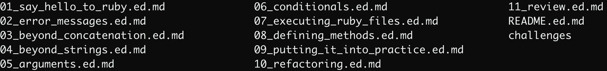

# Creating Zip Files

## Video

Here's a [video guide](https://youtu.be/UfvSaCYdcVk) to creating zip files on the command line.

## 1. Navigate to the correct place in Terminal

To create zip files on your Mac, open up the Terminal application and navigate to the directory that contains the files you'd like to zip up. If you're about to zip up your code for the chapter 1 challenges of Ruby Foundations, go to the `chapter1` directory and verify that you can see the `challenges` directory using `ls`. You should see something like this (note the `challenges` directory)...




## 2. Use the `zip` command

Now you can use the `zip` command to create your zip file, like so...

```shell
; zip -r chapter_1.zip challenges
```

When you come to do the same thing for Chapter 2, just make sure you're in the `chapter2` directory, then do the same thing again this time changing the file name from `chapter_1.zip` to `chapter_2.zip`.


<!-- BEGIN GENERATED SECTION DO NOT EDIT -->

---

**How was this resource?**  
[😫](https://airtable.com/shrUJ3t7KLMqVRFKR?prefill_Repository=makersacademy%2Fpython_foundations&prefill_File=pills%2Fcreating_zipfiles.md&prefill_Sentiment=😫) [😕](https://airtable.com/shrUJ3t7KLMqVRFKR?prefill_Repository=makersacademy%2Fpython_foundations&prefill_File=pills%2Fcreating_zipfiles.md&prefill_Sentiment=😕) [😐](https://airtable.com/shrUJ3t7KLMqVRFKR?prefill_Repository=makersacademy%2Fpython_foundations&prefill_File=pills%2Fcreating_zipfiles.md&prefill_Sentiment=😐) [🙂](https://airtable.com/shrUJ3t7KLMqVRFKR?prefill_Repository=makersacademy%2Fpython_foundations&prefill_File=pills%2Fcreating_zipfiles.md&prefill_Sentiment=🙂) [😀](https://airtable.com/shrUJ3t7KLMqVRFKR?prefill_Repository=makersacademy%2Fpython_foundations&prefill_File=pills%2Fcreating_zipfiles.md&prefill_Sentiment=😀)  
Click an emoji to tell us.

<!-- END GENERATED SECTION DO NOT EDIT -->
